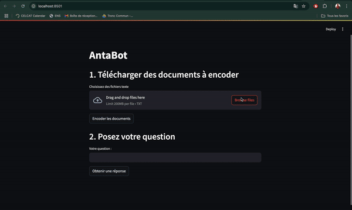

# **Chatbot avec Récupération Augmentée (RAG) et API OpenAI**

Ce projet implémente un chatbot avec Récupération Augmentée (RAG) combiné à une interface interactive. Les utilisateurs peuvent télécharger des documents, poser des questions, et recevoir des réponses générées en utilisant les documents les plus pertinents via l'API OpenAI.

---

## **Fonctionnalités**

- **Téléchargement de documents** : Les utilisateurs peuvent télécharger des fichiers texte (.txt) à encoder.
- **Encodage des documents** : Les documents sont convertis en vecteurs d'embedding à l'aide de `paraphrase-MiniLM-L6-v2`.
- **Recherche des documents pertinents** : Les documents les plus pertinents sont identifiés en fonction de la question posée.
- **Génération de réponses** : Les réponses sont générées via l'API OpenAI en utilisant les documents pertinents comme contexte.
- **Interface de type chatbot** : Une interface conviviale est disponible via Streamlit.

---

## **🚀Démo**


Voici une démo rapide montrant comment fonctionne le projet :




## **Installation**

### **1. Cloner le dépôt**

```bash
git clone https://github.com/sokhna00/embeddingsEtWebApi
cd embeddingsEtWebApi

```

### **2. Installer les dépendances**

```bash
python -m venv venv
source venv/bin/activate  # Sur Windows, utilisez `venv\Scripts\activate`
pip install -r requirements.txt

```

### **3. Configurer la clé API OpenAI dans le fichier .env**

```bash
OPENAI_API_KEY=your_openai_api_key
```

## **Démarrage du projet**

### **4.Démarrer le backend**

```bash
uvicorn main:app --reload
```

### **6.Lancer l'interface utilisateur**

```bash
streamlit run app.py
```
